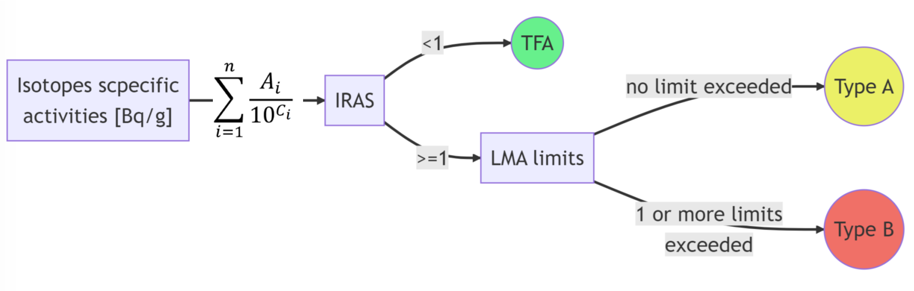
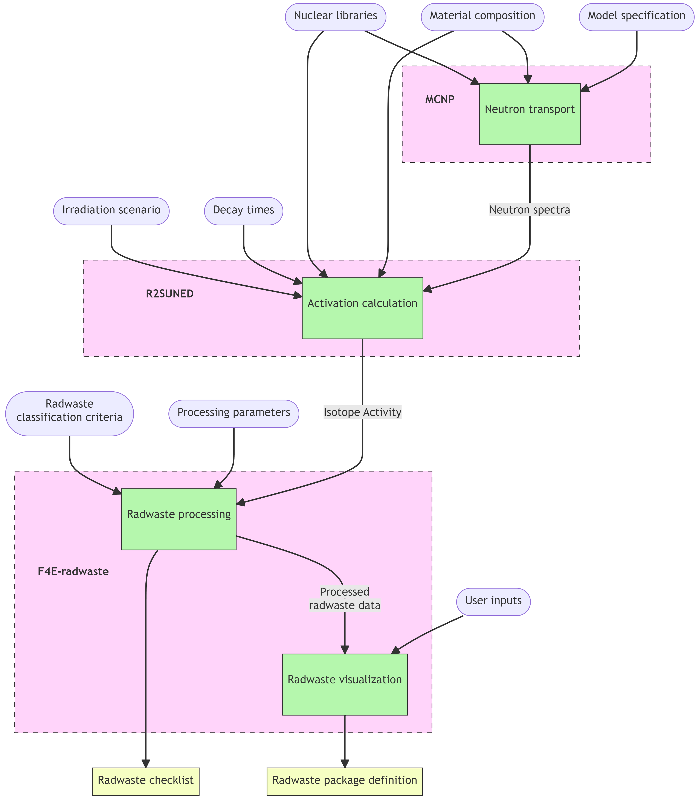

# F4E-radwaste
Program to define and analyze radwaste packages via a fine 3D mesh superimposed to the geometry of a Monte Carlo radiation transport simulation.


[Link to Youtube demo](https://www.youtube.com/watch?v=w3G-Iiu-eTI&ab_channel=F4E-radwaste)

Go to the [User Manual document](resources/F4E-radwaste%20tool%20for%20ITER%20analyses%20-%20F4E_D_32NF66%20v1.2.pdf) to have an in-depth explanation of the methodology and how to use the software.

## Important note
This program handles the last part of a complex multi-step and multi-software process. The inputs F4E-radwaste expects are generated via the D1SUNED3.1.4 patch of MCNP5 and R2SUNED, which are not provided here. This program could be extended in the future to use other Monte Carlo radiation transport and activation codes.

## Install
**Pyhton >3.11!**

The easiest way to install F4E-radwaste is using pip from the parent folder:

```
pip install .
```

## Usage
The code can be used as a package that allows the development of scripts and custom workflows but the easiest way to work with it is via its GUI.

From anywhere if F4E-radwaste is installed in the environment:

```
python -m f4e_radwaste
```

## Methodology

